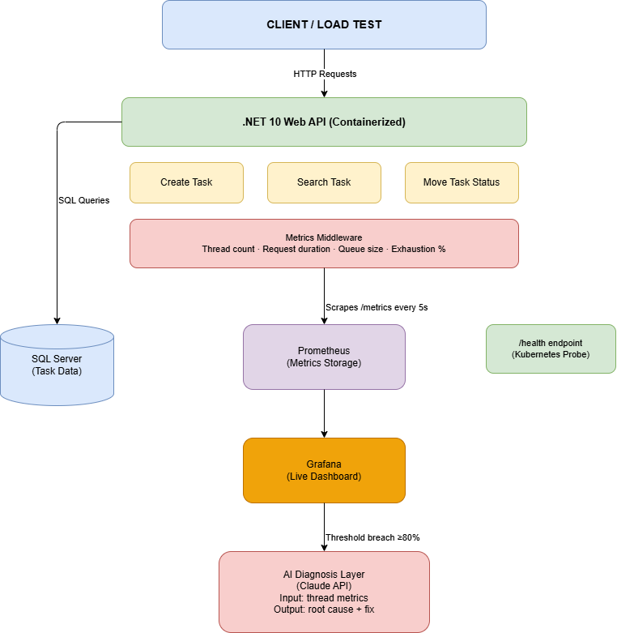

# Tax Filing Observability Platform

> **Built for the Damco Build Challenge**  
> A production-grade Intelligent Observability and Resilience Platform 
> for .NET 10 APIs running on Kubernetes.

---

## The Problem

Our team built a suite of .NET 8 Web APIs powering a tax filing 
workflow system — handling task creation, search, and status 
transitions across the filing lifecycle.

When we attempted to migrate from IIS on Windows servers to AKS 
for better scalability, the system began **failing under 3x load** 
during testing.

**Root cause:** Thread starvation — the .NET thread pool was being 
exhausted under concurrent load.

We had Datadog capturing logs reactively — but by the time logs 
surfaced the issue, **the system had already failed.**

We had no:
- ❌ Proactive thread pool monitoring
- ❌ Early warning alerts before collapse
- ❌ Intelligent diagnosis of root cause
- ❌ Automated remediation guidance

**The migration was abandoned.**

---

## The Solution

An **Intelligent Observability and Resilience Platform** that goes 
beyond passive logging to proactively detect, diagnose, and guide 
remediation of thread starvation and resource exhaustion issues.

---

## Architecture

## Architecture



---

## Key Design Decisions

### 1. Async/Await Throughout
Every database and I/O call uses proper async/await — eliminating 
the `.Result` and `.Wait()` blocking patterns that caused our 
original thread starvation.

### 2. Proactive vs Reactive Monitoring
Instead of waiting for logs to surface failures (Datadog approach), 
we capture thread pool state **on every request** via custom 
Prometheus middleware. We know about problems 15 seconds before 
collapse.

### 3. Three-Tier Alert System
- 🟢 **< 80% exhaustion** → Healthy, monitor
- 🟡 **≥ 80% exhaustion** → Warning logged, alert triggered  
- 🔴 **≥ 95% exhaustion** → Critical, AI diagnosis invoked

### 4. AI-Powered Root Cause Analysis
When thresholds breach, the system automatically collects metrics 
and invokes Claude AI to provide human-readable diagnosis and 
specific remediation steps — not just "something is wrong."

### 5. State Machine for Workflow
Task status transitions follow a strict state machine:

Pending → InProgress → UnderReview → Completed
↓            ↓
Cancelled   Cancelled

Invalid transitions are rejected at the API layer.

### 6. Kubernetes-Ready Design
- Multi-stage Docker build (lean runtime image)
- Non-root container user
- Built-in health check endpoint `/health`
- Retry logic on transient database failures

---

## Tech Stack

| Layer | Technology | Why |
|-------|-----------|-----|
| API | .NET 10 Web API | Latest LTS, native async |
| Database | SQL Server | Production parity with original system |
| Metrics | Prometheus | Kubernetes-native scraping |
| Dashboard | Grafana | Custom thread pool visualisation |
| AI Diagnosis | Claude API | Intelligent root cause analysis |
| Container | Docker + Compose | Full stack reproducibility |
| ORM | Entity Framework Core 10 | Type-safe, async queries |

---

## Running Locally

### Prerequisites
- Docker Desktop
- .NET 10 SDK
- Anthropic API Key

### Quick Start

```bash
# Clone the repository
git clone https://github.com/shivaraj17cm/TaxFilingObservability.git
cd TaxFilingObservability

# Copy example settings
cp TaxFilingAPI/appsettings.Example.json TaxFilingAPI/appsettings.json
# Add your Anthropic API key to appsettings.json

# Start entire stack
docker-compose up --build
```

### Access Points
| Service | URL | Credentials |
|---------|-----|-------------|
| API + Swagger | http://localhost:8080 | — |
| Prometheus | http://localhost:9090 | — |
| Grafana | http://localhost:3000 | admin / admin123 |
| Health Check | http://localhost:8080/health | — |
| Metrics | http://localhost:8080/metrics | — |

---

## API Endpoints

| Method | Endpoint | Description |
|--------|----------|-------------|
| GET | /api/task | Get all tasks |
| GET | /api/task/{id} | Get task by ID |
| GET | /api/task/search | Search by status/assignee/year |
| POST | /api/task | Create new task |
| PATCH | /api/task/{id}/status | Move task status |
| POST | /api/diagnosis/analyze | AI thread pool diagnosis |

---

## Grafana Dashboard

The dashboard shows 8 real-time panels:
- Thread Pool Exhaustion % (Gauge with red/yellow/green zones)
- Threads In Use
- Available Worker Threads
- Active Requests
- Thread Starvation Events
- Max Worker Threads (Capacity)
- Request Duration Over Time
- Total Requests Over Time

---

## What's Incomplete / What I'd Improve

- **No load test included** — would add k6 scripts to simulate 
  3x load and demonstrate the dashboard under pressure
- **Alert Manager not configured** — Prometheus AlertManager 
  would send Slack/email notifications on threshold breach
- **No distributed tracing** — would add OpenTelemetry for 
  request tracing across services
- **AI diagnosis uses fallback** — without API key it falls back 
  to rule-based diagnosis; production would always have the key

---

## Architectural Patterns Used

- **Dependency Injection** — controllers depend on interfaces, 
  not concrete implementations (SOLID - D)
- **Repository/Service Pattern** — business logic separated 
  from HTTP concerns
- **Middleware Pipeline** — cross-cutting observability concerns 
  handled outside business logic
- **State Machine** — workflow transitions enforced at API layer
- **Retry Pattern** — transient database failures handled 
  automatically
- **Multi-stage Docker Build** — lean production images

---

*Built with .NET 10, Docker, Prometheus, Grafana, and Claude AI*